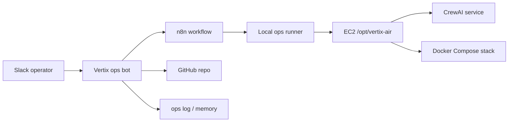

# Ops Architecture

Vertix Air ops has four layers.

## Layer 1: Slack

Slack is the human interface. Operators ask for status, smoke tests, logs, plans, and approvals.

Initial policy:

- Read-only/status commands can run from explicit Slack requests.
- Mutating commands require a human approval step.
- No free-form shell execution from Slack.
- All terminal actions must map to allowlisted command IDs.

## Layer 2: Ops bot

This repository hosts the Slack app and the orchestration brain. It should:

- Route Slack messages.
- Track decisions and blockers.
- Ask for missing context before risky work.
- Post concise status updates.
- Call n8n or the local runner only through defined workflows.

## Layer 3: n8n

n8n is the workflow bridge. It is useful for:

- Slack slash-command or webhook handling.
- Approval gates.
- Calling the local runner.
- Formatting results back to Slack.

n8n should not store long-lived secrets in workflow JSON committed to GitHub. Keep secrets in n8n credentials or EC2 environment files.

## Layer 4: Local runner

The local runner is the only component that should touch the EC2 terminal. It has a narrow API:

- `GET /health`
- `POST /run` with `X-Vertix-Ops-Token`

The runner only executes command IDs defined in code. It does not accept arbitrary commands.

## Agent council

The council is a workflow design, not a swarm of autonomous shells. The first reliable version should be:

- `Commander`: decides what the user is asking for and whether it is safe.
- `Operator`: runs approved allowlisted commands through the runner.
- `Analyst`: reads command output and proposes next steps.
- `Reviewer`: blocks risky or destructive actions until approval.
- `Archivist`: updates GitHub docs, runbooks, and later durable memory.

This keeps control clear: one Slack-facing lead, one terminal path, and one approval policy.
